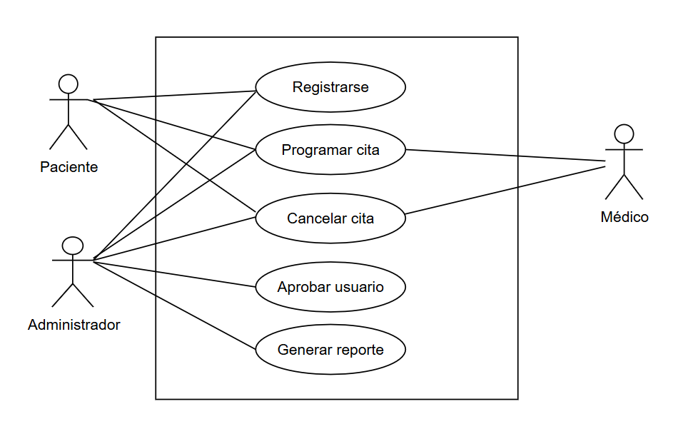

# 📌 Diagrama de Casos de Uso

## Descripción General

Este diagrama representa las interacciones principales que los distintos actores (Paciente, Médico y Administrador) tienen con el sistema SaludPlus.

---

## 🎭 Actores

- **Paciente**: Usuario que busca atención médica.
- **Médico**: Profesional que gestiona y atiende consultas médicas.
- **Administrador**: Encargado de la gestión y validación de usuarios.

---

## 📷 Diagrama Visual

---

> 📌 Ver: [Diagrama de clases ](../diagramas/clases.md) para detalles.
