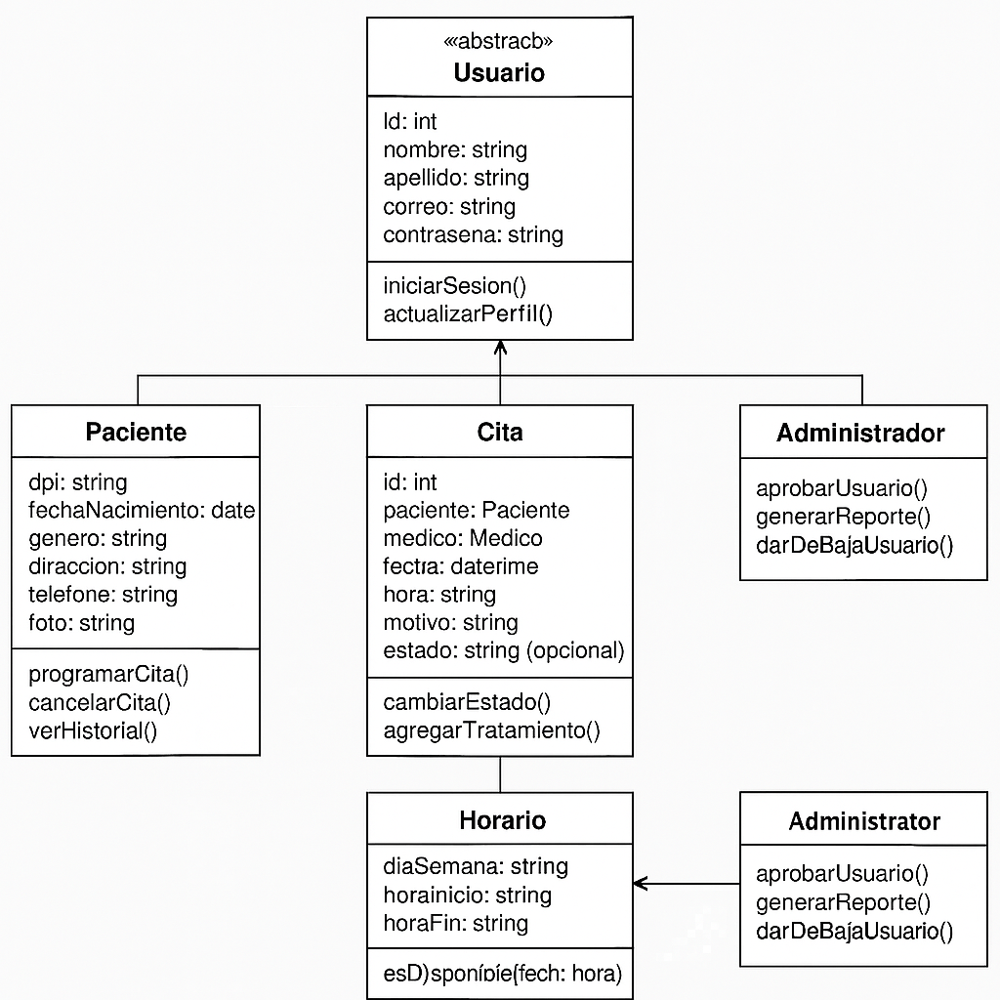

# 🧱 Diagrama de Clases

## 📝 Descripción General

El diagrama de clases representa la estructura lógica del sistema **SaludPlus**, detallando las entidades clave del dominio, sus atributos, métodos y cómo se relacionan entre sí. Este diagrama es esencial para la implementación orientada a objetos del sistema.

---

## 🧩 Principales Clases del Sistema

### 🔹 Usuario (Clase Abstracta)
- **Atributos:**
  - id: int
  - nombre: string
  - apellido: string
  - correo: string
  - contraseña: string (encriptada)
- **Métodos:**
  - iniciarSesion()
  - actualizarPerfil()

### 🔹 Paciente (Hereda de Usuario)
- **Atributos:**
  - dpi: string
  - fechaNacimiento: date
  - genero: string
  - direccion: string
  - telefono: string
  - foto: string
- **Métodos:**
  - programarCita()
  - cancelarCita()
  - verHistorial()

### 🔹 Médico (Hereda de Usuario)
- **Atributos:**
  - numeroColegiado: string
  - especialidad: string
  - direccionClinica: string
  - horario: Horario[]
- **Métodos:**
  - establecerHorario()
  - atenderCita()
  - cancelarCitaPaciente()

### 🔹 Administrador (Hereda de Usuario)
- **Métodos:**
  - aprobarUsuario()
  - generarReporte()
  - darDeBajaUsuario()

### 🔹 Cita
- **Atributos:**
  - id: int
  - paciente: Paciente
  - medico: Medico
  - fecha: datetime
  - hora: string
  - motivo: string
  - estado: string
  - tratamiento: string (opcional)
- **Métodos:**
  - cambiarEstado()
  - agregarTratamiento()

### 🔹 Horario
- **Atributos:**
  - diaSemana: string
  - horaInicio: string
  - horaFin: string
- **Métodos:**
  - esDisponible(fecha, hora)

---

## 🔗 Relaciones entre Clases

- `Paciente` y `Médico` heredan de `Usuario`
- `Médico` tiene múltiples `Horario`
- `Cita` se relaciona con `Paciente` y `Médico`
- `Administrador` gestiona `Usuario`

---

## 🖼️ Diagrama Visual

