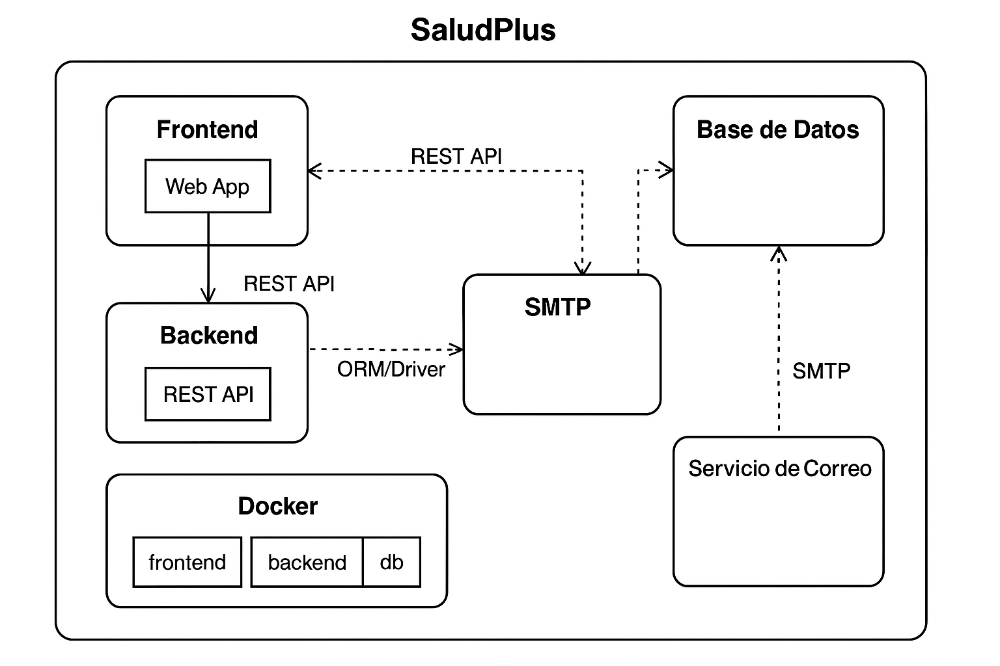

# 🧰 Diagrama de Componentes

## 📝 Descripción General

Este diagrama representa los componentes principales que conforman la plataforma **SaludPlus**, detallando sus responsabilidades y las interfaces de comunicación entre ellos. La arquitectura se basa en una separación clara entre frontend, backend, base de datos y servicios auxiliares.

---

## 🧩 Componentes Principales

### 🔹 Frontend (Web App)
- Lenguaje: Angular 
- Responsabilidades:
  - Interfaz gráfica para pacientes, médicos y administradores
  - Validaciones de formularios
  - Comunicación con el backend vía API REST

### 🔹 Backend (API REST)
- Lenguaje: TypeScript
- Framework: Express
- Responsabilidades:
  - Autenticación y autorización
  - Lógica de negocio
  - Gestión de usuarios y citas
  - Envío de correos

### 🔹 Base de Datos
- Tipo: SQL PostgreSQL 
- Responsabilidades:
  - Persistencia de usuarios, citas, horarios, etc.
  - Relación entre entidades

### 🔹 Servicio de Correo
- Servicio externo **pendiente**
- Responsabilidades:
  - Notificación de cancelación de citas

### 🔹 Docker (Contenerización)
- Cada componente se ejecuta en su contenedor:
  - `frontend`
  - `backend`
  - `db`
- Uso de `docker-compose` para orquestación

---

## 🔗 Relación entre Componentes

- **Frontend** ⇄ (REST API) ⇄ **Backend**
- **Backend** ⇄ (ORM/Driver) ⇄ **Base de datos**
- **Backend** ⇄ (SMTP) ⇄ **Servicio de correo**
- **Todo empaquetado en contenedores Docker**

---

## 🖼️ Diagrama Visual

---
> 📌 Ver: [Diagrama de despliegue](../diagramas/despliegue.md) para detalles.