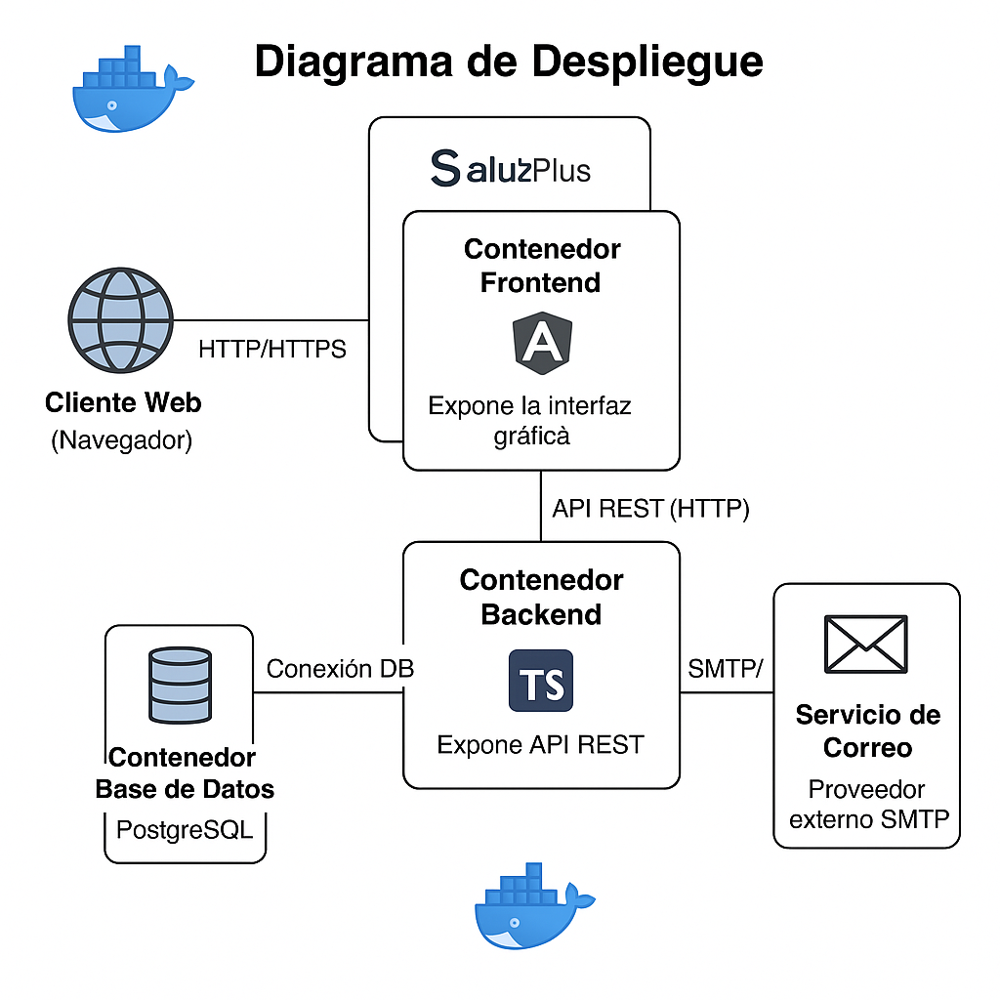

# 🌐 Diagrama de Despliegue

## 📝 Descripción General

Este diagrama representa la arquitectura de despliegue de la aplicación **SaludPlus**, destacando los componentes principales del sistema y la infraestructura sobre la cual están desplegados. El sistema utiliza contenedores Docker para garantizar portabilidad, escalabilidad y facilidad de mantenimiento.

---

## 📦 Nodos y Artefactos

### 🔹 Cliente Web (Navegador)
- Accede a la aplicación desde el navegador.
- Interactúa con el frontend desplegado.

### 🔹 Contenedor Frontend
- Framework: Angular 
- Expone la interfaz gráfica
- Comunica con el backend vía HTTP

### 🔹 Contenedor Backend
- Framework: TypeScript
- Expone API REST
- Se conecta con la base de datos y servicios externos

### 🔹 Contenedor Base de Datos
- Motor: PostgreSQL 
- Almacena datos persistentes de usuarios, citas, horarios, etc.

### 🔹 Servicio de Correo
- Proveedor externo SMTP
- Se conecta desde el backend para envío de notificaciones

---

## 🔄 Interacciones

- Cliente Web → Frontend: HTTP/HTTPS
- Frontend → Backend: API REST (HTTP)
- Backend → Base de Datos: Conexión DB
- Backend → Servicio de Correo: SMTP/API

---

## 🐳 Docker & Orquestación

- El sistema se ejecuta en un entorno contenerizado usando `Docker`.
- `docker-compose` es utilizado para levantar los servicios:
  - frontend
  - backend
  - db

---

## 🖼️ Diagrama Visual

---

> 📌 Ver: [Diagrama de modelo de datos](../diagramas/modelo_datos.md) para detalles.

