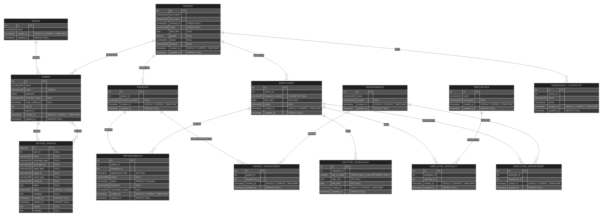

# 🗃️ Modelo de Datos

## Relacional o NoSQL
El sistema utiliza una **base de datos relacional PostgreSQL**, ideal para mantener la integridad de los datos, realizar consultas complejas y garantizar relaciones consistentes entre entidades como usuarios, pacientes y empleados.

## 🧱 Esquema de Tablas

### 📌 `roles`
Define los roles del sistema (e.g., administrador, médico, recepcionista).

| Campo        | Tipo        | Descripción                     |
|--------------|-------------|---------------------------------|
| id           | SERIAL      | Clave primaria                  |
| name         | VARCHAR(50) | Nombre del rol                  |
| created_at   | TIMESTAMP   | Fecha de creación               |
| updated_at   | TIMESTAMP   | Fecha de actualización          |

---

### 👤 `people`
Representa a una persona en general, ya sea paciente, empleado o contacto.

| Campo         | Tipo          | Descripción                      |
|---------------|---------------|----------------------------------|
| id            | SERIAL        | Clave primaria                   |
| first_name    | VARCHAR(100)  | Nombre                           |
| last_name     | VARCHAR(100)  | Apellido                         |
| national_id   | VARCHAR(50)   | Cédula o DNI                     |
| email         | VARCHAR(100)  | Correo electrónico               |
| birth_date    | DATE          | Fecha de nacimiento              |
| gender        | CHAR(1)       | Género                           |
| phone         | VARCHAR(20)   | Teléfono                         |
| address       | VARCHAR(200)  | Dirección                        |
| created_at    | TIMESTAMP     | Fecha de creación                |
| updated_at    | TIMESTAMP     | Fecha de actualización           |

---

### 🔐 `users`
Usuarios registrados del sistema, relacionados con una persona y un rol.

| Campo           | Tipo        | Descripción                          |
|-----------------|-------------|--------------------------------------|
| id              | SERIAL      | Clave primaria                       |
| name            | VARCHAR(100)| Nombre completo                      |
| email           | VARCHAR(100)| Correo único                         |
| password        | BYTEA       | Contraseña cifrada                   |
| remember_token  | VARCHAR(100)| Token de sesión                      |
| email_verified_at| TIMESTAMP  | Fecha de verificación                |
| role_id         | INT         | FK a `roles`                         |
| person_id       | INT         | FK a `people`                        |

---

### 🧍‍♂️ `patients`
Pacientes registrados, asociados a una persona.

| Campo           | Tipo         | Descripción                          |
|-----------------|--------------|--------------------------------------|
| id              | SERIAL       | Clave primaria                       |
| person_id       | INT          | FK a `people`                        |
| insurance_number| VARCHAR(50)  | Número de seguro                     |

---

### 🩺 `employees`
Empleados como médicos o personal clínico.

| Campo          | Tipo         | Descripción                           |
|----------------|--------------|---------------------------------------|
| id             | SERIAL       | Clave primaria                        |
| person_id      | INT          | FK a `people`                         |
| employee_number| VARCHAR(50)  | Código único del empleado             |
| hire_date      | DATE         | Fecha de contratación                 |
| salary         | DECIMAL      | Salario                               |

---

### 🧠 `specialties`
Especialidades médicas disponibles.

| Campo        | Tipo           | Descripción                       |
|--------------|----------------|-----------------------------------|
| id           | SERIAL         | Clave primaria                    |
| name         | VARCHAR(100)   | Nombre de la especialidad         |
| description  | VARCHAR(200)   | Descripción                       |

---

### 🏥 `departments`
Departamentos o clínicas del centro médico.

| Campo        | Tipo           | Descripción                       |
|--------------|----------------|-----------------------------------|
| id           | SERIAL         | Clave primaria                    |
| name         | VARCHAR(100)   | Nombre del departamento           |
| location     | VARCHAR(200)   | Ubicación                         |

---

### 📞 `emergency_contacts`
Contactos de emergencia para una persona.

| Campo     | Tipo          | Descripción                  |
|-----------|---------------|------------------------------|
| id        | SERIAL        | Clave primaria               |
| person_id | INT           | FK a `people`                |
| name      | VARCHAR(100)  | Nombre del contacto          |
| phone     | VARCHAR(20)   | Teléfono                     |

---

### 🔗 `employee_specialty`
Relación entre empleados y especialidades (muchos a muchos).

---

### 🏢 `employee_department`
Relación entre empleados y departamentos (muchos a muchos).

---

### 🧑‍🤝‍🧑 `patient_department`
Relación entre pacientes y departamentos.

---

### 📆 `appointments`
Citas médicas entre pacientes y empleados.

| Campo             | Tipo         | Descripción                          |
|-------------------|--------------|--------------------------------------|
| id                | SERIAL       | Clave primaria                       |
| patient_id        | INT          | FK a `patients`                      |
| employee_id       | INT          | FK a `employees`                     |
| appointment_date  | TIMESTAMP    | Fecha y hora de la cita              |
| reason            | VARCHAR(500) | Motivo de la cita                    |
| status            | VARCHAR(20)  | Estado (scheduled, cancelled, etc.) |
| treatment         | VARCHAR(500) | Tratamiento aplicado                 |
| cancellation_reason| VARCHAR(500)| Motivo de cancelación                |

---

### ⏰ `doctor_schedules`
Horarios de atención por empleado.

| Campo       | Tipo     | Descripción                          |
|-------------|----------|--------------------------------------|
| id          | SERIAL   | Clave primaria                       |
| employee_id | INT      | FK a `employees`                     |
| day_of_week | SMALLINT | Día de la semana (1 a 7)             |
| start_time  | TIME     | Hora de inicio                       |
| end_time    | TIME     | Hora de fin                          |

---

### 🧾 `action_events`
Historial de acciones para auditoría del sistema.

| Campo     | Tipo         | Descripción                         |
|-----------|--------------|-------------------------------------|
| id        | BIGSERIAL    | Clave primaria                      |
| user_id   | INT          | FK a `users` (puede ser NULL)       |
| name      | VARCHAR      | Nombre de la acción                 |
| fields    | TEXT         | Campos afectados                    |
| status    | VARCHAR(25)  | Estado (running, failed, etc.)      |
| exception | TEXT         | Errores si existen                  |
| original  | TEXT         | Valores originales                  |
| changes   | TEXT         | Cambios realizados                  |

---
## 🖼️ ER 

---
> 📌 Ver: [Diagrama de secuencias](../diagramas/secuencias.md) para detalles.