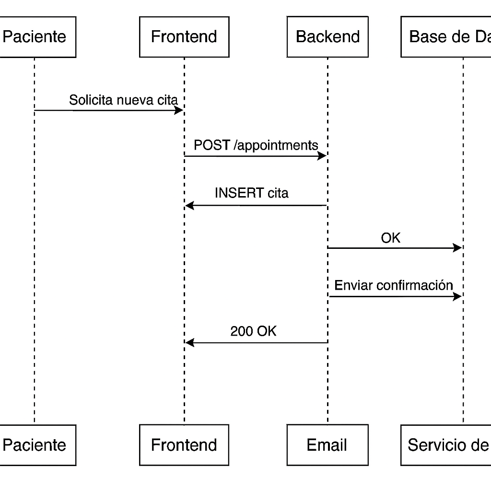

# 🔄 Diagrama de Secuencias

Este diagrama representa el flujo para el caso de uso **"Agendar una Cita Médica"** en el sistema **SaludPlus**.

## 📋 Descripción

El paciente interactúa con la interfaz web para solicitar una cita. El frontend envía la solicitud al backend, el cual la valida, almacena los datos en la base de datos y envía una notificación de confirmación por correo.

## 🧩 Participantes

- **Paciente** (usuario del sistema)
- **Frontend** (cliente Angular)
- **Backend** (API en TypeScript)
- **Base de Datos** (PostgreSQL)
- **Servicio de Correo** (SMTP externo)

## 🖼️ Diagrama Visual

