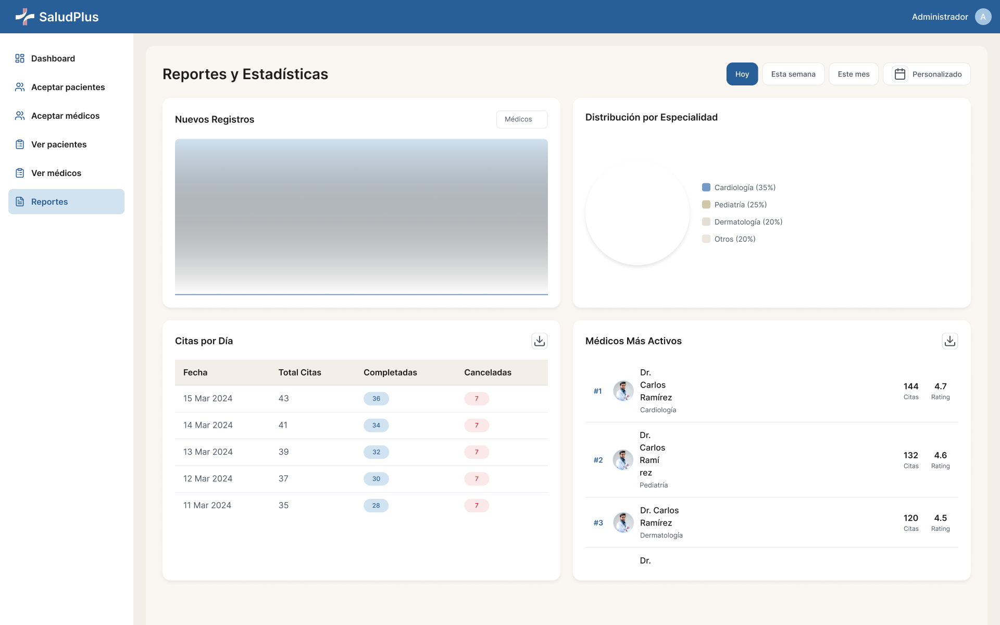
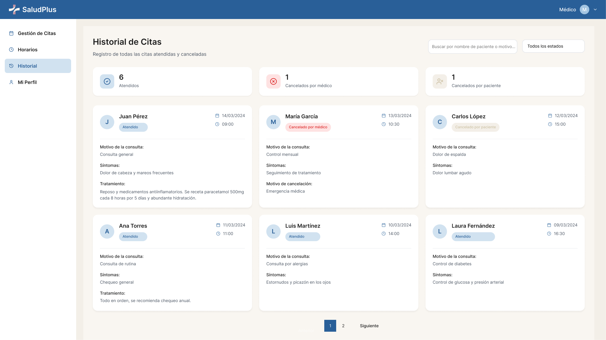
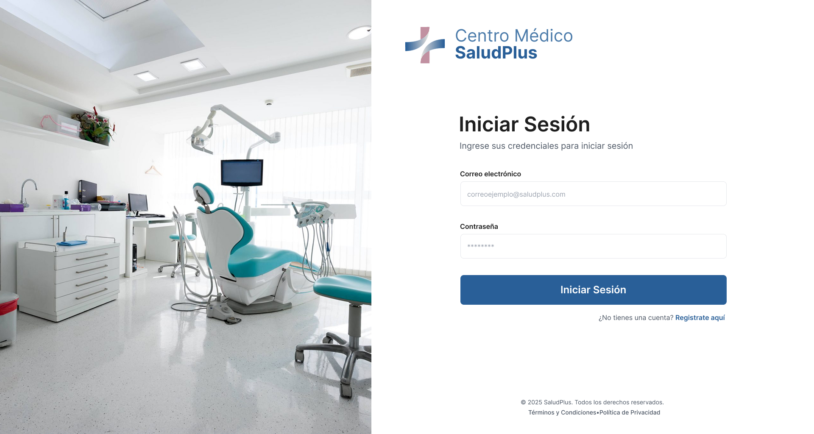

# 🖌️ Prototipos de Interfaces

## Administrador

- **Aceptar médicos**

  

* **Aceptar pacientes**

  

* **Reportes**

  

* **Ver médicos**

  

* **Ver pacientes**

  

## Médicos

- Gestión de citas

  

* Gestión de horarios

  

* Historial

  

* Perfil

  

## Auth

- **Login**

  

* **Registro Médico**

  

* **Seleccionar tipo cuenta**

  

* **Verificación administrador**

  

* **Modal Éxito**

  

* **Modal Advertencia**

  

  ---
