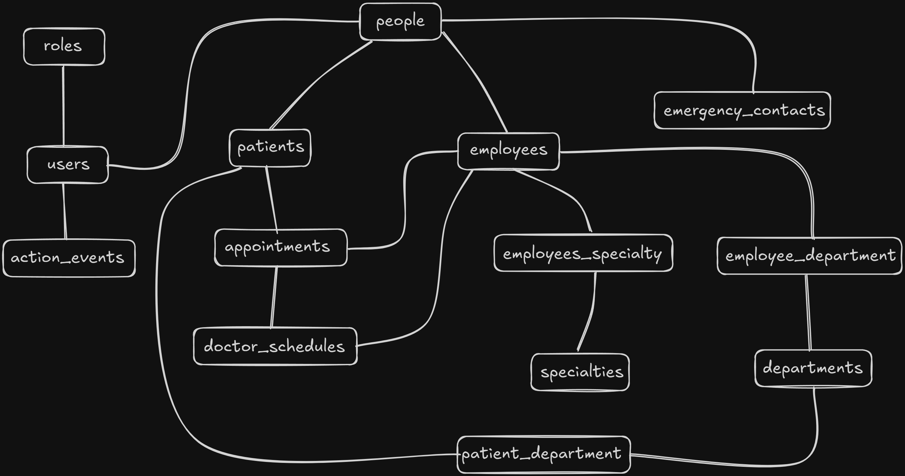
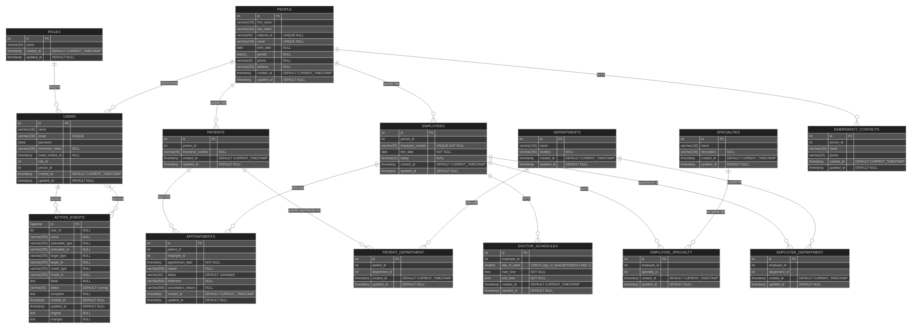

# Manual Técnico

# Base de datos

# PostgreSQL

Para este proyecto se utilizó PostgreSQL como motor de base de datos. La base de datos ya tenia que estar ne la nube, se evaluaron diferentes opciones como Google Cloud, Amazon Web Services, Microsoft Azure, entre otros. Se decidió utilizar [Supabase](https://supabase.com/) por la facilidad de uso y la integración con otras herramientas.

## Supabase

Supabase es una base de datos PostgreSQL en la nube, con una API RESTful instantánea, autenticación y autorización, y mensajería en tiempo real.

## Script

El script de la base de datos se encuentra en el archivo [database](database.sql). En este script se crean las tablas necesarias para el proyecto.

```sql
-- Tabla de Roles
CREATE TABLE roles (
    id SERIAL PRIMARY KEY,
    name VARCHAR(50) NOT NULL,
    created_at TIMESTAMP NOT NULL DEFAULT CURRENT_TIMESTAMP,
    updated_at TIMESTAMP NULL
);

-- Tabla de Personas
CREATE TABLE people (
    id SERIAL PRIMARY KEY,
    first_name VARCHAR(100) NOT NULL,
    last_name VARCHAR(100) NOT NULL,
    national_id VARCHAR(50) UNIQUE NULL,
    email VARCHAR(100) UNIQUE NULL,
    birth_date DATE NULL,
    gender CHAR(1) NULL,
    phone VARCHAR(20) NULL,
    address VARCHAR(200) NULL,
    created_at TIMESTAMP NOT NULL DEFAULT CURRENT_TIMESTAMP,
    updated_at TIMESTAMP NULL
);

-- Tabla de Usuarios
CREATE TABLE users (
    id SERIAL PRIMARY KEY,
    name VARCHAR(100) NOT NULL,
    email VARCHAR(100) NOT NULL UNIQUE,
    password BYTEA NOT NULL,
    remember_token VARCHAR(100) NULL,
    email_verified_at TIMESTAMP NULL,
    role_id INT NOT NULL,
    person_id INT NOT NULL,
    created_at TIMESTAMP NOT NULL DEFAULT CURRENT_TIMESTAMP,
    updated_at TIMESTAMP NULL,
    FOREIGN KEY (person_id) REFERENCES people(id),
    FOREIGN KEY (role_id) REFERENCES roles(id)
);

-- Tabla de Pacientes
CREATE TABLE patients (
    id SERIAL PRIMARY KEY,
    person_id INT NOT NULL,
    insurance_number VARCHAR(50) NULL,
    created_at TIMESTAMP NOT NULL DEFAULT CURRENT_TIMESTAMP,
    updated_at TIMESTAMP NULL,
    FOREIGN KEY (person_id) REFERENCES people(id)
);

-- Tabla de Empleados (Médicos)
CREATE TABLE employees (
    id SERIAL PRIMARY KEY,
    person_id INT NOT NULL,
    employee_number VARCHAR(50) UNIQUE NOT NULL,
    hire_date DATE NOT NULL,
    salary DECIMAL(10,2) NULL,
    created_at TIMESTAMP NOT NULL DEFAULT CURRENT_TIMESTAMP,
    updated_at TIMESTAMP NULL,
    FOREIGN KEY (person_id) REFERENCES people(id)
);

-- Tabla de Especialidades
CREATE TABLE specialties (
    id SERIAL PRIMARY KEY,
    name VARCHAR(100) NOT NULL,
    description VARCHAR(200) NULL,
    created_at TIMESTAMP NOT NULL DEFAULT CURRENT_TIMESTAMP,
    updated_at TIMESTAMP NULL
);

-- Tabla de Departamentos (Clínicas)
CREATE TABLE departments (
    id SERIAL PRIMARY KEY,
    name VARCHAR(100) NOT NULL,
    location VARCHAR(200) NULL,
    created_at TIMESTAMP NOT NULL DEFAULT CURRENT_TIMESTAMP,
    updated_at TIMESTAMP NULL
);

-- Tabla de Contactos de Emergencia
CREATE TABLE emergency_contacts (
    id SERIAL PRIMARY KEY,
    person_id INT NOT NULL,
    name VARCHAR(100) NOT NULL,
    phone VARCHAR(20) NOT NULL,
    created_at TIMESTAMP NOT NULL DEFAULT CURRENT_TIMESTAMP,
    updated_at TIMESTAMP NULL,
    FOREIGN KEY (person_id) REFERENCES people(id)
);

-- Relación Muchos a Muchos: Empleado - Especialidad
CREATE TABLE employee_specialty (
    id SERIAL PRIMARY KEY,
    employee_id INT NOT NULL,
    specialty_id INT NOT NULL,
    created_at TIMESTAMP NOT NULL DEFAULT CURRENT_TIMESTAMP,
    updated_at TIMESTAMP NULL,
    FOREIGN KEY (employee_id) REFERENCES employees(id),
    FOREIGN KEY (specialty_id) REFERENCES specialties(id)
);

-- Relación Muchos a Muchos: Empleado - Departamento (Clínica)
CREATE TABLE employee_department (
    id SERIAL PRIMARY KEY,
    employee_id INT NOT NULL,
    department_id INT NOT NULL,
    created_at TIMESTAMP NOT NULL DEFAULT CURRENT_TIMESTAMP,
    updated_at TIMESTAMP NULL,
    FOREIGN KEY (employee_id) REFERENCES employees(id),
    FOREIGN KEY (department_id) REFERENCES departments(id)
);

-- Relación Paciente - Departamento (opcional)
CREATE TABLE patient_department (
    id SERIAL PRIMARY KEY,
    patient_id INT NOT NULL,
    department_id INT NOT NULL,
    created_at TIMESTAMP NOT NULL DEFAULT CURRENT_TIMESTAMP,
    updated_at TIMESTAMP NULL,
    FOREIGN KEY (patient_id) REFERENCES patients(id),
    FOREIGN KEY (department_id) REFERENCES departments(id)
);

-- Tabla de Citas
CREATE TABLE appointments (
    id SERIAL PRIMARY KEY,
    patient_id INT NOT NULL,
    employee_id INT NOT NULL,
    appointment_date TIMESTAMP NOT NULL,
    reason VARCHAR(500) NULL,
    status VARCHAR(20) NOT NULL DEFAULT 'scheduled',
    treatment VARCHAR(500) NULL,
    cancellation_reason VARCHAR(500) NULL,
    created_at TIMESTAMP NOT NULL DEFAULT CURRENT_TIMESTAMP,
    updated_at TIMESTAMP NULL,
    FOREIGN KEY (patient_id) REFERENCES patients(id),
    FOREIGN KEY (employee_id) REFERENCES employees(id)
);

-- Tabla de Horarios de Médicos
CREATE TABLE doctor_schedules (
    id SERIAL PRIMARY KEY,
    employee_id INT NOT NULL,
    day_of_week SMALLINT NOT NULL CHECK (day_of_week BETWEEN 1 AND 7),
    start_time TIME NOT NULL,
    end_time TIME NOT NULL,
    created_at TIMESTAMP NOT NULL DEFAULT CURRENT_TIMESTAMP,
    updated_at TIMESTAMP NULL,
    FOREIGN KEY (employee_id) REFERENCES employees(id)
);

-- Tabla de Historial de Acciones
CREATE TABLE action_events (
    id BIGSERIAL PRIMARY KEY,
    user_id BIGINT NULL,
    name VARCHAR(255) NULL,
    actionable_type VARCHAR(255) NULL,
    actionable_id VARCHAR(255) NULL,
    target_type VARCHAR(255) NULL,
    target_id VARCHAR(255) NULL,
    model_type VARCHAR(255) NULL,
    model_id VARCHAR(255) NULL,
    fields TEXT NULL,
    status VARCHAR(25) NULL DEFAULT 'running',
    exception TEXT NULL,
    created_at TIMESTAMP NULL,
    updated_at TIMESTAMP NULL,
    original TEXT NULL,
    changes TEXT NULL
);

```

### Diagrama de la base de datos

#### Modelo Conceptual



#### Modelo Entidad-Relación


Link del diagrama: [ERD](https://mermaid.live/edit#pako:eNrNWG1v4jgQ_iuRv3QrdSte28I3Dnx3aCGwEG7VFVJkkilYTZzIdnbLdvnv5yQEAiQhvV1dqdQWkmfG83hePONXZHk2oDYC3qNkyYk7Z5r6mYwGeKq9xl_CH8qkRm1t_Gn_6Bvh1orwD83KtcaIC_s3krogJHF9zeJAJNgmkdoc9fCfndnA0LqzyQTrhmn0h3hqdIbjOcqSDXz7VFafDQYJfBP_i_-O8Wg8wCVNrlaUzU-UC2keWn4AcEju-5izpB4jjqkWmaOZ3v88wwf2nSgEl1AnHxvS1RaUy5UZfZyjY0Ss6lpbArOBZwCS5WpqNX_lMSjEKBCxbQ5CZMDew4mzKZ5M3-LDAu8dbnbausVaAtF8IsR3j9s54hxccBfATek9Ayvcn2gl8xtw-kQTqsfokAj3HFDBcvjQBy48dvD4XdKnY_SV0nObn2NxOi0oEwEnzAKTBeEGXkho4eF4MHrE-DcwBNd3vDWkCCYJPTKyk3pFOexyOgsEFnWJoyLvWhPEIXx9Ibs2HeNuvzNQsfEb0jIqODYIi1M_LJ0XwrGHx52JMSwR_WU5Op5FLoggHuLJX1jvPprdkW50ur-a5YX0t-fOZSS7mcTvYwnGu7Q-LtHCV-lJHLl-9yq947WP2V8hZoNPuHSByUs5f95GzFdZdmz8hfHqjMejvl6quhQxynTh3ibi-56CRYwLjpn9IRY1OERklqh0Liv1MhApolfCWoEdOGBf5WqW4e6GthQoj4BW2CY4TlQrzVx73uVMGHWN0cScdv_GvdmgVNOQ6SKhTnUnCkmyNr0n8zvAs1pfqe1-0j6kH_6BjS8Y61pV6-g97f76mEXoCi7N6GO2d6NXajA4h_nfU6Br9Ee6if85zoEFXQrVNBMnazsD9SqerHLjs9mMj6FzGGJFg9pCdd9y7b8Ffn595ZQlyFJ6t9DzOl01kjulVMbITI0SXqQaccGxRaGWrBznAWOULa9O9MGLBf-xdcuHn42m3fIep0uqJu48uooSW8Ix34NgjC82fv78-NF73Y6bbYUngi4ZSSS2dwknKA6-GpZVYctB7oaoEOwHYKusBZ6N3c8jpcAnHVwoFZ4VkEjEZm4FDnMutp049Mfe8MTURCB9TkU7Et4x7OB7a3PxoTE25AqcVNQTAiciGV3ciVB6QCkWU3ERdgWg2SVWTLUhkXtACTKwQNvtSHpqOCNteezA5uO9z-h99jGhUiO86xFhaS9YO0fHkVfiGNnkxYhyOXDFEN0gF7hLqI3aKCrYatdXoBp-FMJswp9DjRuFI4H0pmtmobbkAdwg7gXLFWo_EUeob3Fqb28WE4hP2FfP230Fm0qPD-NryOg2MoKg9it6Qe168_a-VW_eVSoPD41K465-g9aoXa20btVvvVapN-r3rVaturlBPyKlldtWs9mqNerVWuOu1ni42_wLEIoblQ)
